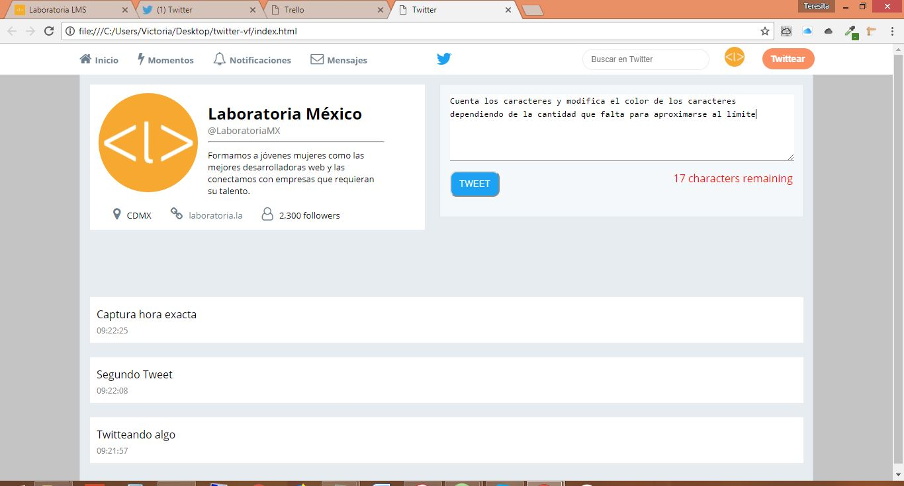

# Twitter

## Instrucciones

Replicar el newsfeed de **Twitter**, como se muestra en la siguiente imagen, con opción a tomar como referencia la página oficial <https://twitter.com/>

  

## Estructura del proyecto:

1. El proyecto se encuentra en una carpeta general llamada **Ejercicio Twitter** la cual está estructurada con *4 carpetas internas*, una carpeta de *Assets* donde se encuentran todas las fonts(iconos fueron tomados de la página de Font Awesome), icons e imagenes. Otra carpeta de *CSS* que contiene el archivo de estilos del sitio, otra carpeta de *JS* donde se encuentra nuestro archivo de Javascript, y por último nuestra carpeta de *views*.

2. Dentro de la carpeta general támbien se encuentra un *index.html* que esta enlazado con un archivo *style.css* y de *Js* que se encuentran en las carpetas correspondientes.

### Estructura de HTML:

1. Nuestra web esta conformada por **4 secciones** principalmente:

  1. **El Nav**: Sección donde se encuentra el menú de Inicio, Momentos, Notificaciones, Mensajes, el logotipo de twitter en la parte central, nuestro input de búsqueda, la foto de perfil del usuario y un botón para twittear. Esta sección solo tiene estilos con CSS no cuenta con ninguna funcionalidad por el momento.

  2. **La sección 1**: Sección donde se encuentran los datos generales del usuario (nombre, ubicación, correo, followers, foto de perfil), esta sección no cuenta con ninguna funcionalidad es solo a nivel maquetación.

  3. **La sección 2**: Sección donde tenemos un textarea donde se cacha el mensaje y se van contabilizando los caracteres a traves de un contador y dependiendo del número de caracteres se va cambiando el color del contador, esta textarea se va ajustando al contenido y cuándo terminas tu idea la posteas a traves del boton tweett , toda la funcionalidad de la sección se agregó con archivo JS.

  4. **La sección 3**: Sección donde se pinta el mensaje indicando la hora, esta funcionalidad tambien se realizó con JS.

## Diagrama de flujo

  

## Resultado

  
